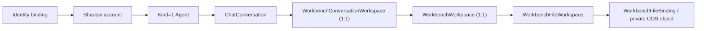
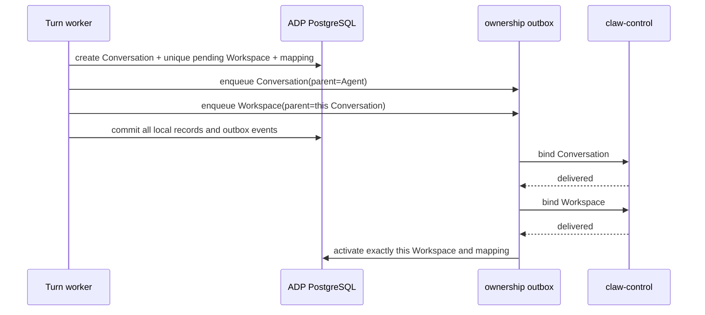

# Workbench Workspace ownership

This module implements the local Workspace boundary required by the hosted
workbench. It does not modify the upstream `chat_conversation` schema. The
provider binding follows Tencent ADP API `2026-05-20`: `DescribeConversation`
returns `ConversationWorkspace.WorkspaceId`, which is captured server-side and
never used as the browser-visible identifier.

## Ownership chain and cardinality

The authoritative local scope is always the complete tuple:

```text
(binding_id, account_id, customer_id, application_id, provider_app_id,
 app_profile_id, config_version, conversation_id)
```

Every owned Conversation has exactly one distinct `Kind=conversation`
Workspace. An opaque local `ww_*` handle is derived with HMAC-SHA-256 from the
server-only service key and the complete scope including `conversation_id`.
It is not a provider Workspace identifier. Replaying creation for the same
Conversation is idempotent; creating a second Conversation always produces a
different Workspace.



The three additive tables are:

- `workbench_workspace`: Conversation ID, exact owner/App/config scope,
  lifecycle state, and an optional encrypted provider locator.
- `workbench_conversation_workspace`: one-to-one mapping from an existing
  Conversation UUID to the owned local Workspace without altering the upstream
  `chat_conversation` table.
- `workbench_file_workspace`: exact scope and optional Workspace assignment for
  an opaque `WorkbenchFileId`.

All tables are registered in `core.migration.Migration.tables()`. ADP uses its
independent PostgreSQL database; deployment must run the existing migration
initialization before enabling workbench traffic.

## Creation and reporting

Conversation creation writes the Conversation, its unique Workspace, mapping,
and both ownership outbox events in one database transaction. Delivery occurs
after commit and preserves the required parent graph:



No Conversation is returned as owned until its mapping and Workspace are both
active. Outbox rejection or temporary unavailability therefore fails closed.
The Workspace's immutable `ConversationId` must equal the Workspace outbox
parent, so retries cannot re-parent a Workspace to another Conversation.

Files uploaded before a Turn use the approved graph exception and are reported
as `file(parent=account)`. Their local `WorkspaceId` remains null. When a file is
later used with an existing active Conversation, the server checks the complete
scope and assigns it once to that Conversation's Workspace. Reuse from a
different Conversation then resolves as not found. First-Turn use may remain
account-owned because no Conversation exists yet; it never authorizes another
account, customer, App, profile, or config version.

## Access and IDOR behavior

Conversation list/get/history/delete, file resolution, and local Workspace
lookups use every ownership column above. A supplied Conversation, File, or
Workspace ID is never sufficient by itself. Cross-user, cross-customer,
cross-App, cross-profile, cross-config, and cross-Conversation lookups resolve
as not found (404), while an explicitly supplied App that conflicts with the
active trusted context is rejected (403). Deleted Conversation mappings are
retained as `deleted` audit evidence but excluded from active access.

## Provider locator encryption and rotation

Provider Workspace locators may only enter `ProviderLocatorCiphertext` through
the internal binding methods. `DescribeConversation` first validates the exact
owned Conversation, Agent, App and Type=5 response, then binds the provider
Workspace once. A later response containing a different locator is a 502
integrity failure. The binding stores an A256KW/A256GCM JWE with a non-secret `kid`. Plaintext
locators are bounded to 4096 UTF-8 bytes, are not logged, and are absent from
public Workspace projections. The response sent to the browser replaces the
provider identifier with the owned local `ww_*` handle; any other provider
Workspace locator field is replaced with `[workspace-redacted]`.

Locator encryption deliberately does not reuse the service request-signing
secret. Configure an independent 32-byte standard-base64 key:

```text
WORKBENCH_WORKSPACE_LOCATOR_KEY=<base64 of 32 random bytes>
WORKBENCH_WORKSPACE_LOCATOR_KEY_ID=v2
WORKBENCH_WORKSPACE_LOCATOR_PREVIOUS_KEYS_JSON={"v1":"<old base64 key>"}
WORKBENCH_WORKSPACE_HOST_SUFFIXES=<verified provider DNS suffixes, comma-separated>
```

Generate a key with `openssl rand -base64 32`. During rotation, move the old
key into `WORKBENCH_WORKSPACE_LOCATOR_PREVIOUS_KEYS_JSON`, set a new active key
and key ID on every blue/green instance, then re-encrypt or retire old rows
before deleting the old entry. Missing, malformed, wrongly sized, or unknown
keys fail closed; locator ciphertext and key material must never be returned to
the browser or written to logs.

Keep `WORKBENCH_WORKSPACE_HOST_SUFFIXES` empty until a real
`CreateWorkspaceCredential` response has been captured and its DNS ownership
verified. An empty or non-matching allowlist fails directory/download requests
closed. Do not add a wildcard, public suffix such as `com`, or a suffix copied
from browser input.

The credential endpoint is treated as an origin, not a base path: only an
empty path or `/` is accepted and the server reconstructs `https://<host>`.
Every A/AAAA result is resolved before the request and all results must be
globally routable. That exact validated address set is pinned into the
`aiohttp` connector for the lifetime of the request while the original host is
retained for TLS SNI and certificate checks. Redirects remain disabled. This
prevents a verified-looking DNS name from rebinding to loopback, RFC1918,
link-local, metadata, or another non-public address between validation and
connection. Workspace credentials accept only the documented
`X-File-Ticket` header; arbitrary provider-selected header names and control
characters in the short-lived token fail closed.

## Download boundary

`GET /file/download` accepts only an owned local `ww_*` handle in workbench
mode and checks the complete current identity/customer/App/profile/config scope.
It decrypts the provider Workspace ID only after that check, requests a fresh
`CreateWorkspaceCredential` server-side, and streams a bounded file response
through the same-origin backend. The browser never receives the provider
Workspace ID, credential endpoint, access token, token header, COS locator or
AppKey. The response body is copied in 64 KiB chunks with a cumulative size
ceiling and never buffered as a complete file in the ADP process. Opening and
streaming the response holds the same durable customer/member runtime lease as
other workbench operations; disconnect, overflow, success, and upstream error
all close the provider response and release the lease. The upstream request
deadline is capped below the lease lifetime so an expired lease cannot make a
still-streaming download invisible to the concurrency guard.

`POST /adp/ListDir` follows the same mapping. It accepts only a canonical
`/workdir` path and depth 1, uses the trusted provider App ID and encrypted
Workspace locator, limits the provider response to 1 MiB/1000 entries, and
projects only name, type, canonical path and bounded size. Directory traversal,
cross-scope handles, provider locator changes, redirects, non-TLS credential
domains and oversized responses fail closed.

The legacy `FetchFile`/WebOffice path is not enabled in workbench mode because
it returns a signed COS preview locator to browser JavaScript. Customers can
list and download owned files through the server proxy; rich Office preview
requires a later same-origin renderer that does not expose the upstream locator.

## Limits and required regression coverage

- Exactly one Workspace per Conversation; the existing Conversation/plan limit
  bounds the total Workspace count.
- Provider locator plaintext: at most 4096 UTF-8 bytes.
- Workspace, Conversation, and File identifiers remain bounded by their model
  columns and existing request validators.
- Private file size/count/storage limits remain governed by `WorkbenchPolicy`
  and the secure file pipeline.
- Audit and application logs contain opaque IDs and error classes only; never
  locator ciphertext, decrypted locators, AppKey, AK/SK, or signed URLs.

Regression coverage must include same-Conversation idempotence, distinct
Workspaces for two Conversations, exact outbox parents, exact-scope SQL,
cross-context fail-closed behavior, encrypted locator key rotation and public
projection, pre-Turn file ownership, file-to-Conversation assignment, migration
registration, one-time provider locator binding, safe directory projection,
bounded server-side download and cross-scope download denial.
